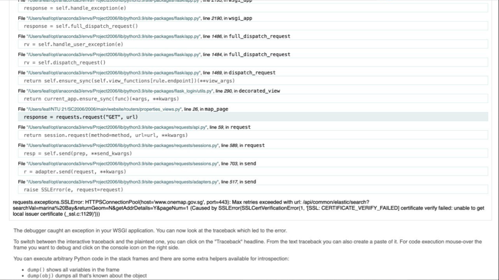

### MYSQL Settings
DB name: mydb  
username: root  
password: 96173880

### How to start the website
1. Create a MYSQL database using the above details
2. Clone repository onto your preferred ide
3. In the terminal, switch to the directory where "requirements.txt" is located
4. Run "pip install -r requirements.txt" in the terminal line
5. Run main.py
6. Let the application create the database (if not created yet)
7. Import the information for the property table using clean_properties.csv
8. Make sure that the property table has these information first. If not, continuously refresh the schemas until the actual property table appears  

1. Import the information for the property_images table using property_images_db.csv 
2. Make sure that the property_images table has these information first. If not, continuously refresh the schemas until the actual property_images table appears  

1.  Website is now working
2.  **NOTE:** Website may stop working if the secret_key email/password combination has been changed
3.  You are free to change it to your own email/password

### Default Accounts
1. Landlord  
email: johndoe@landlord.com  
password: 123456789aA$  
{Account is the owner of all default properties}

2. Admin  
email: admin@admin.com  
password: 123456789aA$ 

3. Tenant  
email: jackdoe@tenant.com 
password: 123456789aA$

4. Tenant  
email: test@test.com  
password: 123456789aA$

### Things to take note when editing/deleting default properties
1. **ALL** default properties are using the same placeholder image and approval documents
2. To prevent default properties from having broken images and approval documents, **DO NOT** edit/delete them
3. **ONLY** edit/delete properties that you have created

### Blackbox Testing
1. Run the server
2. On another terminal, run "pytest"

### Bug that may occur between OneMap and certifi package
On 20/10/2023, this error occured,  

The certifi package did not contain the SSL certificate for the OneMap API.  
As a temporary fix, the SSL certificate was manually added to cacert.pem, which resides in the certifi package.  
If the error occurs again, copy/paste the cacert.pem located in the 2006 project folder into this directory "\Python\Python310\Lib\site-packages\certifi"

