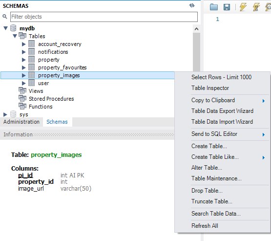

### MYSQL Settings
DB name: mydb  
username: root  
password: 96173880

### How to start the website
1. Create a MYSQL database using the above details
2. Clone repository onto your preferred ide
3. Run "pip install -r requirements.txt" in the command line
4. Run main.py
5. Let the application create the database (if not created yet)
6. Import the information for the property table using clean_properties.csv
7. Make sure that the property table has these information first. If not, continuously refresh the schemas until the actual property table appears  

8. Import the information for the property_images table using property_images_db.csv 
9. Make sure that the property_images table has these information first. If not, continuously refresh the schemas until the actual property_images table appears  

10. Website is now working
11. NOTE: Website may stop working if the secret_key email/password combination has been changed
12. You are free to change it to your own email/password

### Default Accounts
1. Landlord  
email: johndoe@landlord.com  
password: 123456789aA$  
{Account is the owner of all default properties}

2. Admin  
email: admin@admin.com  
password: 123456789aA$ 

3. Tenant  
email: jackdoe@tenant.com 
password: 123456789aA$

### Things to take note when editing/deleting default properties
1. **ALL** default properties are using the same placeholder image and approval documents
2. To prevent default properties from having broken images and approval documents, **DO NOT** edit/delete them
3. **ONLY** edit/delete properties that you have created

